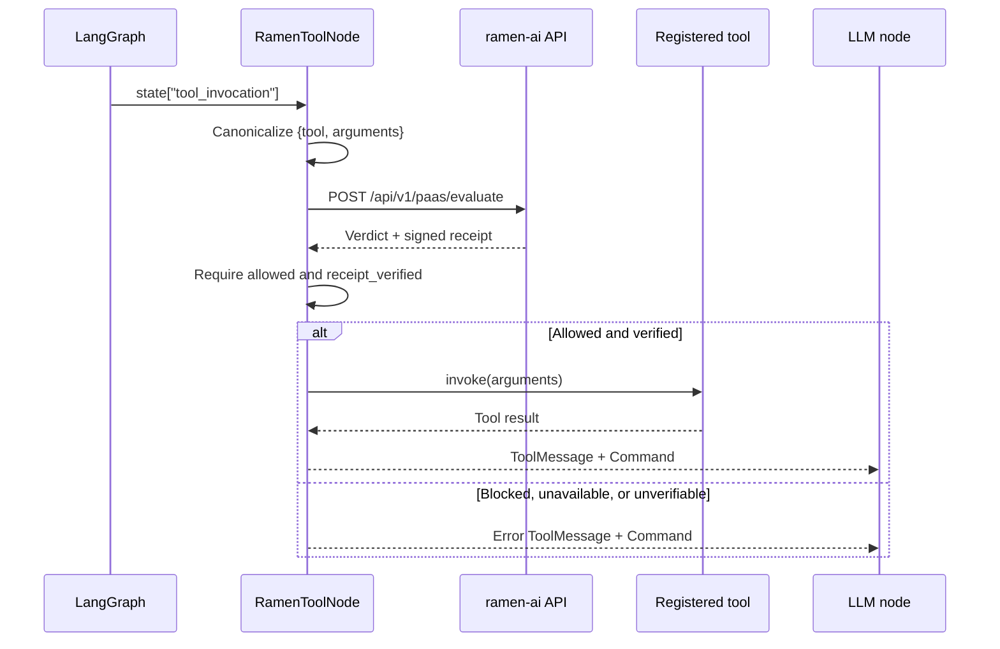
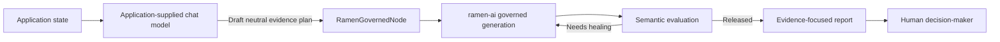

<p align="center">
  <a href="https://ramenai.dev">
    
  </a>
</p>

<h1 align="center">ramen-foundry</h1>

<p align="center"><strong>LangGraph governance nodes and human-review workflow templates powered by ramen-ai.</strong></p>

<p align="center">
  <a href="https://ramenai.dev">ramen-ai</a> ·
  <a href="https://github.com/ramen-ai-dev/ramen-ai-integrations">Integrations</a> ·
  <a href="https://github.com/ramen-ai-dev/ramen-ai-integrations/tree/master/core-clients/python">Python SDK</a> ·
  <a href="https://ramenai.dev/pricing">Get an API key</a>
</p>

---

`ramen-foundry` supplies reusable Python nodes for putting deterministic ramen-ai governance boundaries inside LangGraph workflows. It supports two enforcement points:

- **Before tool execution:** `RamenToolNode` evaluates a canonical tool call, verifies its governance receipt, and executes only registered, allowed calls.
- **Before final content release:** `RamenGovernedNode` delegates generation, semantic evaluation, and one automatic healing retry to ramen-ai's governed-generation cascade.

The package also includes `ResumeScreeningAgent`, an evidence-focused HR workflow template whose output always requires review by a human decision-maker.

## Architecture

### Govern a tool before execution



`RamenToolNode` fails closed. The tool is not executed when evaluation fails, policy blocks the call, receipt verification fails, the tool is not registered, or tool execution raises an exception.

### Govern final content and require human review



The included HR template compiles the graph `START → draft_review_prompt → governed_resume_review → END`. Its `requires_human_review` result is a mandatory application-level signal; the template does **not** install a LangGraph interrupt, checkpoint, or approval UI.

## Requirements

- Python 3.10 or newer
- A [ramen-ai API key](https://ramenai.dev/pricing)
- A concrete LangChain `BaseChatModel` implementation when using `ResumeScreeningAgent`
- A provider key for bring-your-own-key generation, unless provider credentials are managed by your ramen-ai enterprise deployment

Runtime dependencies are pinned by this package:

| Dependency | Version |
|---|---:|
| `ramen-ai-core` | `0.3.2` |
| `langgraph` | `1.2.11` |
| `langchain-core` | `1.6.0` |
| `pydantic` | `2.13.4` |

## Install from source

```bash
git clone https://github.com/ramen-ai-dev/ramen-foundry.git
cd ramen-foundry
python3 -m venv .venv
source .venv/bin/activate
python -m pip install -e .
```

This source-install path is documented because publication of `ramen-foundry` to a package registry is not asserted by this repository.

## Credentials and provider routing

Keep credentials in environment variables and pass them explicitly to the SDK and Foundry nodes:

```bash
export RAMEN_API_KEY="your-ramen-api-key"
export OPENAI_API_KEY="your-provider-api-key"
```

```python
import os

from ramen_ai import RamenClient

client = RamenClient(api_key=os.environ["RAMEN_API_KEY"])
provider_key = os.environ["OPENAI_API_KEY"]
```

Supported provider names are `openai`, `anthropic`, `google`, `synthetic`, and `hyperbolic`. When supplied, `provider_key` and `provider_name` are forwarded as request-level provider headers. Omit them only when your ramen-ai deployment supplies managed provider credentials.

`RamenClient` does not read `RAMEN_API_KEY` automatically; the application must pass it to `RamenClient(api_key=...)`.

## Usage

### Guard a resolved tool call

```python
import os

from langchain_core.tools import tool
from ramen_ai import RamenClient
from ramen_foundry import RamenToolNode, ToolInvocation


@tool
def lookup_inventory(sku: str) -> dict[str, object]:
    """Return inventory details for a SKU."""
    return {"sku": sku, "available": True}


client = RamenClient(api_key=os.environ["RAMEN_API_KEY"])

guarded_tools = RamenToolNode(
    client=client,
    tools={"lookup_inventory": lookup_inventory},
    llm_node="assistant",
    bundle_ids=["your-bundle-id"],
    provider_key=os.environ.get("OPENAI_API_KEY"),
    provider_name="openai",
)

command = guarded_tools(
    {
        "tool_invocation": ToolInvocation(
            name="lookup_inventory",
            arguments={"sku": "SKU-123"},
            tool_call_id="call-1",
        )
    }
)
```

Add `guarded_tools` to your graph as the node that receives resolved tool calls. Every return path produces a LangGraph `Command` that routes to `llm_node`. Its state update contains:

| Key | Value |
|---|---|
| `messages` | One success or error `ToolMessage` |
| `governance_error` | `None` on success; a reason string on failure |
| `tool_invocation` | Cleared to `None` |

A call proceeds only when the ramen-ai verdict contains both `allowed=True` and `receipt_verified=True`.

### Generate governed final content

```python
import os

from ramen_ai import RamenClient
from ramen_foundry import RamenGovernedNode

client = RamenClient(api_key=os.environ["RAMEN_API_KEY"])

generate_final = RamenGovernedNode(
    client=client,
    policy_ids=["your-policy-id"],
    provider_key=os.environ["OPENAI_API_KEY"],
    provider_name="openai",
)

update = generate_final(
    {
        "governed_prompt": (
            "Write the final customer response using only the approved facts."
        )
    }
)

if update["governance_error"] is None:
    print(update["governed_content"])
```

`RamenGovernedNode` uses the synchronous `RamenClient.generate_governed` method with one healing retry. It does not stream. Released output is written to `governed_content`; blocked or failed generation writes `None` there and provides a safe `governance_error` instead.

### Run the human-reviewed resume template

The template accepts any concrete `BaseChatModel`; install and configure the adapter used by your application separately.

```python
import os

from langchain_core.language_models.chat_models import BaseChatModel
from ramen_ai import RamenClient
from ramen_foundry import ResumeScreeningAgent, ResumeScreeningRequest


def review_resume(llm: BaseChatModel) -> None:
    client = RamenClient(api_key=os.environ["RAMEN_API_KEY"])
    agent = ResumeScreeningAgent(
        llm=llm,
        client=client,
        provider_key=os.environ.get("OPENAI_API_KEY"),
        provider_name="openai",
    )

    result = agent.screen(
        ResumeScreeningRequest(
            resume_text="Candidate resume text",
            job_description="Role requirements",
        )
    )

    if result.governance_error:
        print(result.governance_error)
        return

    assert result.requires_human_review is True
    print(result.report)
```

The template uses the fixed EU AI Act Proxy Bias policy ID `0d5ed2af-5e98-4a8c-92c3-dea26c07bf9a`. It asks for job-relevant evidence, missing information, and reviewer questions. It never asks the model to rank candidates or recommend hiring, rejection, or eligibility decisions.

## Public API reference

All supported top-level imports come from `ramen_foundry`:

| Export | Purpose |
|---|---|
| `RamenToolNode` | Evaluates and verifies a resolved tool call before invoking a registered LangChain tool. |
| `RamenGovernedNode` | Generates final content through the ramen-ai self-correcting cascade. |
| `ToolInvocation` | Pydantic input model for a resolved tool call. |
| `ResumeScreeningAgent` | Compiled evidence-focused resume-review workflow. |
| `ResumeScreeningRequest` | Validated resume and job-description input model. |
| `ResumeScreeningResult` | Governed report/error result with a mandatory human-review signal. |
| `EU_AI_ACT_PROXY_BIAS_POLICY_ID` | Fixed policy UUID used by the resume workflow. |

### `ToolInvocation`

```python
ToolInvocation(
    *,
    name: str,
    arguments: dict[str, Any] = {},
    tool_call_id: str,
)
```

| Field | Contract |
|---|---|
| `name` | Non-empty registered tool name. |
| `arguments` | Tool keyword arguments; defaults to an empty dictionary. |
| `tool_call_id` | Non-empty identifier copied to the returned `ToolMessage`. |

### `RamenToolNode`

```python
RamenToolNode(
    *,
    client: RamenClient,
    tools: Mapping[str, BaseTool],
    llm_node: str,
    policy_ids: Sequence[str] | None = None,
    bundle_ids: Sequence[str] | None = None,
    provider_key: str | None = None,
    provider_name: str | None = None,
)
```

At least one `policy_id` or `bundle_id` is required. Calling the node expects `state["tool_invocation"]` to contain a `ToolInvocation` or equivalent mapping and returns `Command`. Missing state or invalid input fails validation before API evaluation.

The evaluated payload is deterministic compact JSON with sorted keys:

```json
{"arguments":{"sku":"SKU-123"},"tool":"lookup_inventory"}
```

### `RamenGovernedNode`

```python
RamenGovernedNode(
    *,
    client: RamenClient,
    policy_ids: Sequence[str] | None = None,
    bundle_ids: Sequence[str] | None = None,
    prompt_key: str = "governed_prompt",
    content_key: str = "governed_content",
    provider_key: str | None = None,
    provider_name: str | None = None,
)
```

At least one policy or bundle is required. Calling the node expects a non-blank string at `state[prompt_key]` and returns a state-update dictionary.

| Output key | Success | Blocked or failed |
|---|---|---|
| `content_key` | Released content | `None` |
| `governed_evaluation` | Evaluation object | Not set |
| `governance_error` | `None` | Safe reason string |
| `messages` | `AIMessage` containing released content | `AIMessage` describing the failure without blocked content |

### `ResumeScreeningAgent`

```python
ResumeScreeningAgent(
    *,
    llm: BaseChatModel,
    client: RamenClient,
    provider_key: str | None = None,
    provider_name: str | None = None,
)

agent.screen(request: ResumeScreeningRequest) -> ResumeScreeningResult
```

The supplied `llm` drafts only the neutral evidence plan. Final report generation passes through `RamenGovernedNode` and the fixed proxy-bias policy.

### `ResumeScreeningRequest`

```python
ResumeScreeningRequest(
    *,
    resume_text: str,
    job_description: str,
)
```

Both fields must be non-empty strings.

### `ResumeScreeningResult`

```python
ResumeScreeningResult(
    *,
    report: str | None,
    governance_error: str | None,
    requires_human_review: bool = True,
    policy_id: str = EU_AI_ACT_PROXY_BIAS_POLICY_ID,
)
```

A successful result has a report and no governance error. A blocked or failed result has no report and includes a safe error. `requires_human_review` defaults to `True` and does not itself pause execution.

## Underlying SDK and HTTP API

Foundry is powered by the [`ramen-ai-core` Python SDK](https://github.com/ramen-ai-dev/ramen-ai-integrations/tree/master/core-clients/python). The default API base URL is `https://api.ramenai.dev`.

| Foundry boundary | SDK method | HTTP endpoint |
|---|---|---|
| Tool pre-execution | `RamenClient.evaluate_compliance` | `POST /api/v1/paas/evaluate` |
| Governed final content | `RamenClient.generate_governed` | `POST /api/v1/generate/governed` |

### Authentication headers

| Header | Purpose |
|---|---|
| `Authorization: Bearer <RAMEN_API_KEY>` | Authenticates the ramen-ai request. |
| `X-Provider-Key: <provider key>` | Optional BYOK credential used for generation/evaluation compute. |
| `X-Provider: <provider name>` | Optional provider route. |

### Passive evaluation contract used by `RamenToolNode`

The node sends `input`, `policy_ids` and/or `bundle_ids`, and `context={"tool_name": ...}`. The SDK verifies the returned V5 receipt signature and hash binding locally. Relevant result fields include `allowed`, `receipt_verified`, `receipt_valid`, `receipt_reason`, `receipt_alert`, `steering`, resolved `policy_ids`, and raw `data`.

### Governed-generation contract used by `RamenGovernedNode`

The node sends the prompt, policy/bundle scope, provider routing, and `max_retries=1`. The underlying SDK accepts non-blank prompts up to 10,000 characters and allows `max_retries` values of `0` or `1`. SDK-level generation options support temperatures from `0` through `2`, maximum-token values from `1` through `4096`, and optional healing-trail exposure; the current Foundry node does not expose those generation options.

The Python SDK also offers streaming governed generation with `status`, `heartbeat`, and `complete` events. The current `RamenGovernedNode` intentionally calls only the non-streaming method.

## Failure and security semantics

- **Fail closed:** tool execution requires an affirmative policy verdict and a locally verified receipt.
- **No blocked-content release:** governed denials write no generated content to the configured content key.
- **Explicit scope:** both node constructors reject configurations without a policy or bundle.
- **Explicit errors:** evaluation outages, unverified receipts, unknown tools, tool exceptions, governed denials, transport failures, and unexpected generation failures are represented explicitly.
- **Structured governed failures:** policy exhaustion raises `GovernanceDeniedException`; other governed API, transport, or protocol failures raise `GovernedGenerationException` in the SDK and are converted to safe graph-state errors by the node.
- **Credentials stay application-owned:** never hard-code API or provider keys; load them from your secret manager or environment.

## Package status

- Current version: `0.1.0`
- Package type: synchronous Python library
- Build backend: Hatchling
- No CLI, server, deployment manifest, or bundled provider-specific chat adapter
- License: MIT, as declared in `pyproject.toml`

## Ecosystem

- [ramen-ai platform](https://ramenai.dev)
- [ramen-ai integrations and SDKs](https://github.com/ramen-ai-dev/ramen-ai-integrations)
- [Python core SDK](https://github.com/ramen-ai-dev/ramen-ai-integrations/tree/master/core-clients/python)
- [Plans and API keys](https://ramenai.dev/pricing)
